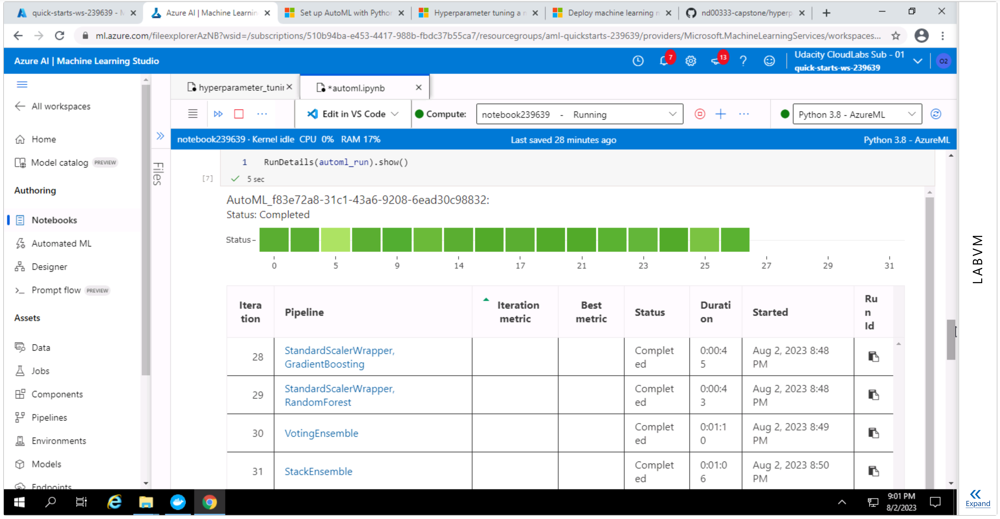
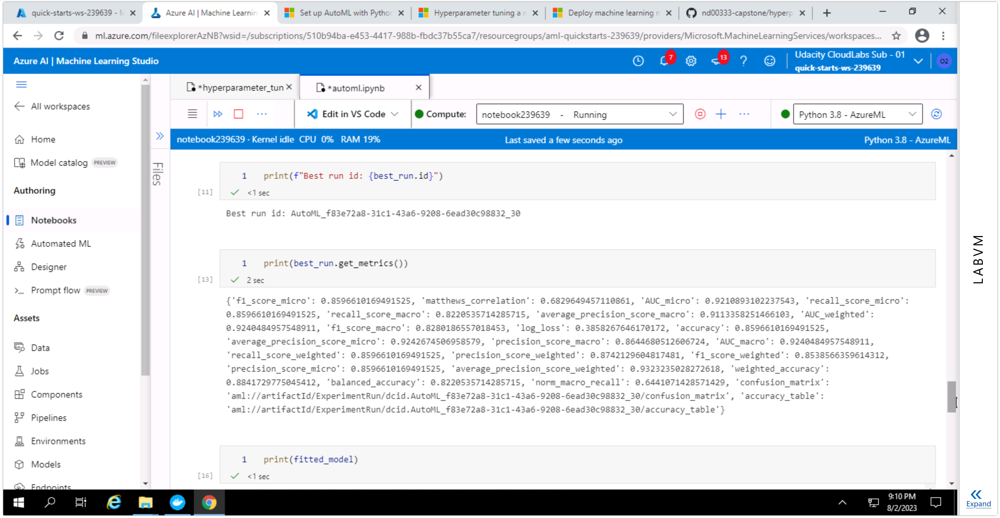
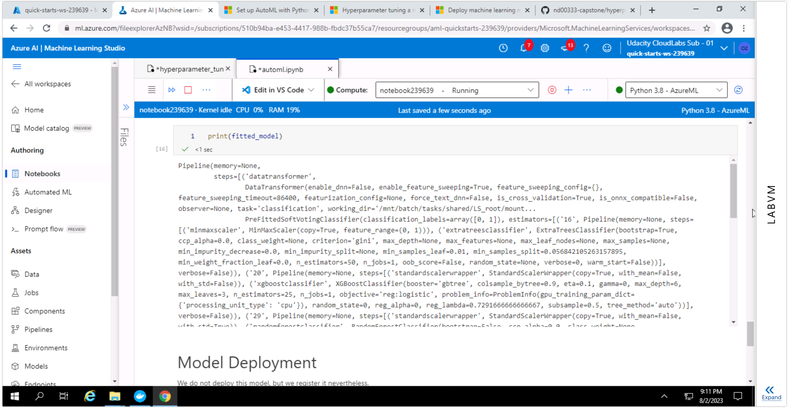
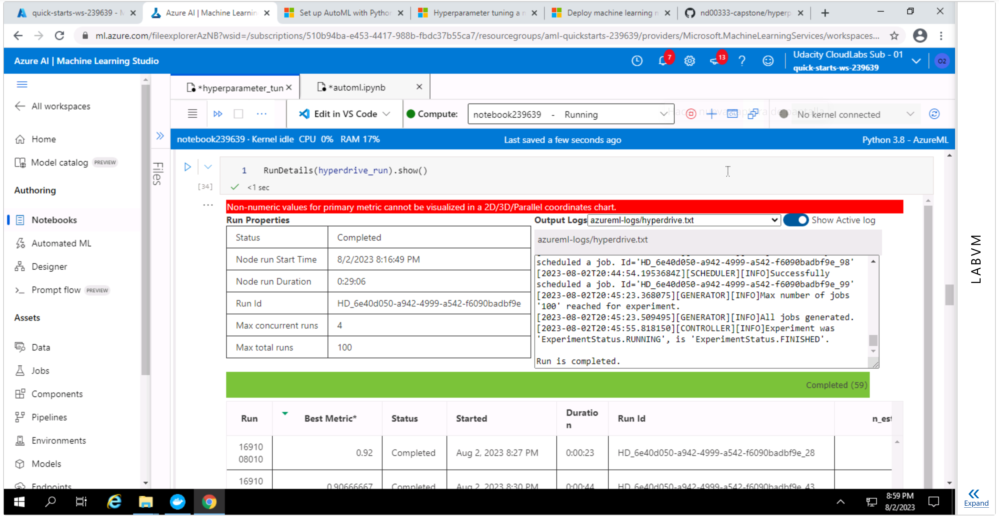
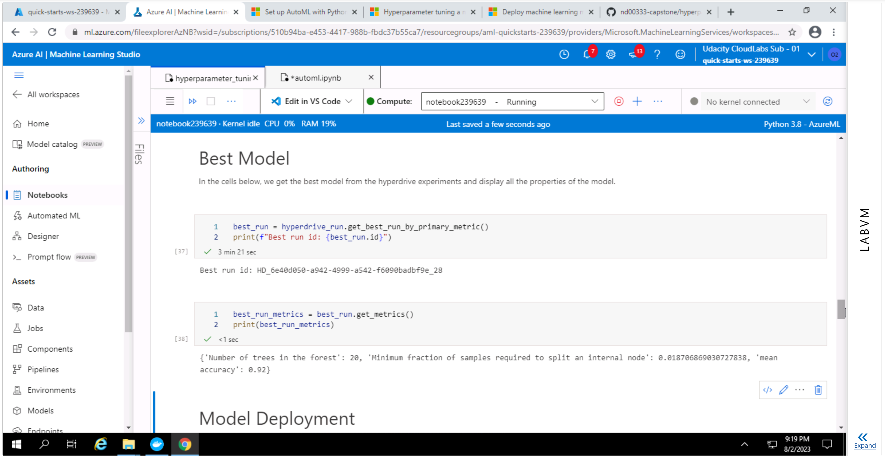
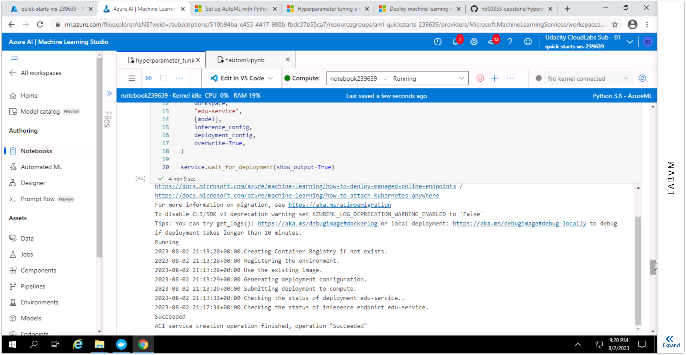
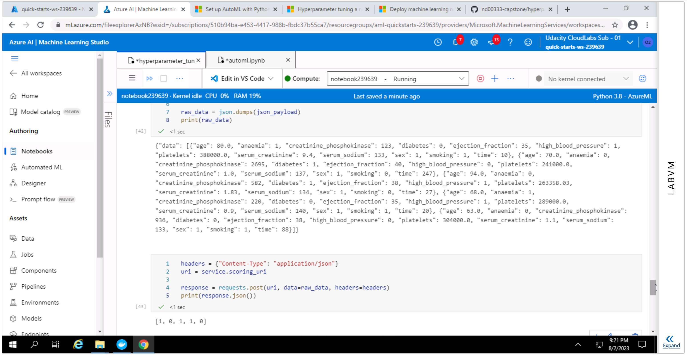
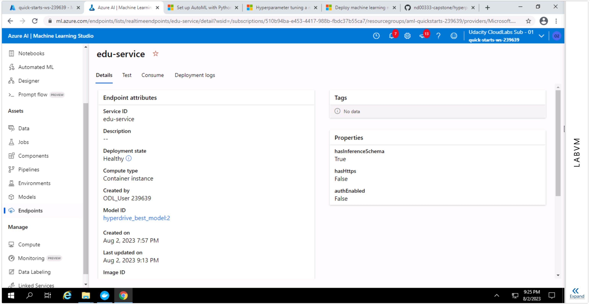

# Capstone Project -- Azure Machine Learning Engineer

This is the README file for the final project in the Udacity nanodegree "Machine Learning Engineer with Microsoft Azure."

The project has two main parts.
In the first part, we use AutoML to automatically train several models and select the best one.
In the second part, we use HyperDrive to tune the hyperparameters of a Random Forest model and select those that yield the best metrics.
We then deploy one of these models by using an online endpoint and test it.

The following Azure tutorials were particularly useful when working on this project:

- [Set up AutoML training with Python](https://learn.microsoft.com/en-us/azure/machine-learning/how-to-configure-auto-train?view=azureml-api-1)
- [Hyperparameter tuning a model with Azure Machine Learning](https://learn.microsoft.com/en-us/azure/machine-learning/how-to-tune-hyperparameters?view=azureml-api-1)
- [Deploy machine learning models to Azure](https://learn.microsoft.com/en-us/azure/machine-learning/how-to-deploy-and-where?view=azureml-api-1&tabs=python)

## Dataset

### Overview

For this final project we'll be using the [Heart Failure Prediction](https://www.kaggle.com/datasets/andrewmvd/heart-failure-clinical-data) dataset from Kaggle.
This dataset contains medical records for 299 patients with heart failure,
along with a column indicating survival as a binary variable.


### Task

Our goal is to predict survival from the rest of the data.
This means that we are faced with a classification problem with two classes.

### Access

We manually upload the csv file and register it as an Azure ML dataset,
which can then be accessed by name from a Jupyter notebook.

## Automated ML

We configure AutoML taking the following considerations into account:

- `task` is set to classification, which matches our use case.
- `training_data` is set to the dataset we instantiated above.
- `label_column_name` is the name of the target column, DEATH_EVENT. This is a binary variable with slight class imbalance; about two-thirds of all patients survived while one-third did not.
- `n_cross_validations=5` splits the dataset into five folds, using each of them in sequence as a test set while training on the remaining four, to better assess model performance and avoid overfitting. This is also useful since our dataset doesn't include a predefined train/test split.
- as primary metric to evaluate experiments we choose `AUC_weighted`, since the threshold-dependent metrics, like accuracy, recall and precision, may not optimize as well for small datasets like the one we're using.
- early stopping is enabled, so that the experiment can end early if results are discouraging.
- we set a timeout of one hour to avoid running out of time with the Udacity VM.
- as `compute_target` we choose a compute cluster we created manually beforehand.


### Results

The best model is a voting ensemble, whose members include several scaling steps, an XGBoost classifier, a LightGBMC classifier, and a random forest classifier. Here are the details:

```
Paste model details in here.
```

The model has an `AUC_weighted` metric of 0.9240.

One possible improvement for the future may be selecting the winning model according to a metric that is better suited to our business needs.
In this medical application, it's important to identify all patients under heart failure risk, even if this leads to a few false negatives.
Therefore, recall may be a better metric to choose the winning model than our primary metric for the AutoML run, weighted AUC.

Another possible improvement is to use _stratified_ cross validation, to better account for class imbalance.

RunDetails widget:



Best run id and metrics:



Fitted model:



## Hyperparameter Tuning

We're using a random forest classifier, because random forests tend to generate reasonable predictions across a wide range of data while requiring little configuration.

We're letting HyperDrive select the best combination of the hyperparameters `n_estimators`, the number of trees in the forest, and `min_samples_split`, the minimum fraction of samples required to split an internal node.
For `n_estimators` we provide a list of values Hyperdrive can choose from, namely, 20, 50, 100, 200.
This list includes the default value (100) and values below and above it, sampled in an approximately logarithmic way.
For `min_samples_split` we give `loguniform(-6, -2)` as an option to the random parameter sampling.
This means that the logarithm of the return value is uniformly distributed and constrained to the inverval
[0.002479, 0.1353], approximately.

We're using a "Bandit" early termination policy, which ends runs when the primary metric isn't within the specified slack factor of the most successful run.

Our primary metric is mean accuracy, which training should maximize.


### Results

The best random forest model has a mean accuracy of 0.92 with and hyperparameters `n_estimators=20` trees and `min_samples_split=0.0187`.

Although the accuracy obtained seems good, one way to improve on these results could be to include other hyperparameters of the random forest classifier in the search. This is of course computationally costly, but it may be worth the effort.

Another possible improvement is choosing a primary metric that is better suited to our business needs, as discussed above for the AutoML run.

From a technical point of view, using pipelines to e.g. separate the train/test split and preprocessing from the actual training may lead to improved performance, since the hyperparameters are only used in the training step.

Finally, if we want to compare the results of the AutoML run with those of the Hyperdrive run in as fair a manner as possible, we should use the same primary metric in both cases.

RunDetails:



Best run id and metrics:



## Model Deployment

We deployed the best model from the Hyperdrive run as a web service and tested it with sample input.
The web service expects input data to be a string that can be serialized to a JSON object with a "data" name whose value is an array of objects with names matching the column names of the original csv file, like this:

```
{
    "data": [
        {
            "age": 80.0,
            "anaemia": 1,
            "creatinine_phosphokinase": 123,
            "diabetes": 0,
            "ejection_fraction": 35,
            "high_blood_pressure": 1,
            "platelets": 388000.0,
            "serum_creatinine": 9.4,
            "serum_sodium": 133,
            "sex": 1,
            "smoking": 1,
            "time": 10
        },
        {
            "age": 70.0,
            "anaemia": 0,
            "creatinine_phosphokinase": 2695,
            "diabetes": 1,
            "ejection_fraction": 40,
            "high_blood_pressure": 0,
            "platelets": 241000.0,
            "serum_creatinine": 1.0,
            "serum_sodium": 137,
            "sex": 1,
            "smoking": 0,
            "time": 247
        }
    ]
}
```

Successful deployment:



Deployed model test:



Healthy endpoint:



## Screen Recording

Screencast: https://youtu.be/XCLA6S7hpP8
