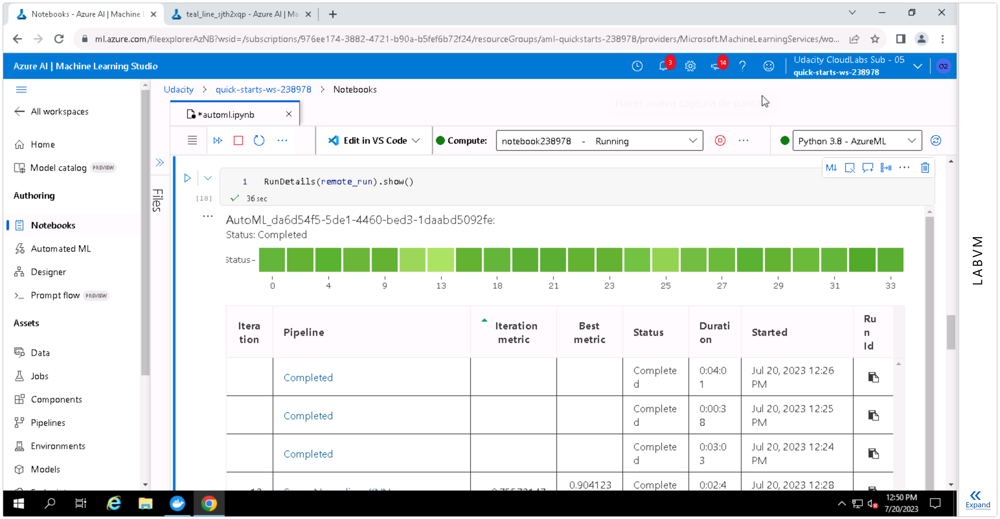

# Capstone Project -- Azure Machine Learning Engineer

This is the README file for the final project in the Udacity nanodegree "Machine Learning Engineer with Microsoft Azure."

The project has two main parts.
In the first part, we use AutoML to automatically train several models and select the best one.
In the second part, we use HyperDrive to tune the hyperparameters of a Random Forest model and select those that yield the best metrics.
We then deploy one of these models by using an online endpoint and test it.

## Dataset

### Overview

For this final project we'll be using the [Heart Failure Prediction](https://www.kaggle.com/datasets/andrewmvd/heart-failure-clinical-data) dataset from Kaggle.
This dataset contains medical records for 299 patients with heart failure,
along with a column indicating survival as a binary variable.

### Task

Our goal is to predict survival from the rest of the data.
This means that we are faced with a classification problem with two classes.

### Access

We manually upload the csv file and register it as an Azure ML dataset,
which can then be accessed by name from a Jupyter notebook.

## Automated ML

We configure AutoML taking the following considerations into account:
- task is set to classification, which matches our use case
- training_data is set to the dataset we instantiated above
- label_column_name is the name of the target column, DEATH_EVENT
- n_cross_validations=5 splits the dataset into five folds, using each of them in sequence as a test set while training on the remaining four, to better assess model performance
- as primary metric to evaluate experiments we choose AUC weighted
- early stopping is enabled, so that the experiment can end early if results are discouraging
- we set a timeout of one hour to avoid running out of time with the Udacity VM
- as compute_target we choose a compute cluster we created beforehand

### Results

The `AUC_weighted` metric is 0.92. The model is a voting ensemble, whose members include several scaling steps, an XGBoost classifier, a LightGBMC classifier, and a random forest classifier.

## Hyperparameter Tuning

We're using a random forest (RF) classifier, because RF tend to generate reasonable predictions across a wide range of data while requiring little configuration.

We're letting HyperDrive select the best combination of the hyperparameters `n_estimators`, the number of trees in the forest, and `min_samples_split`, the minimum fraction of samples required to split an internal node.

We're using a "Bandit" early termination policy, which ends runs when the primary metric isn't within the specified slack factor of the most successful run.

Our primary metric is mean accuracy, which training should maximize.

### Results

We got a mean accuracy of 0.92 with a random forest with `n_estimators=200` trees and `min_samples_split=0.0406`.

## Model Deployment

We deployed the AutoML pipeline by using an online endpoint.

## Screen Recording

Screencast: https://youtu.be/49Cz3SP_OyA
